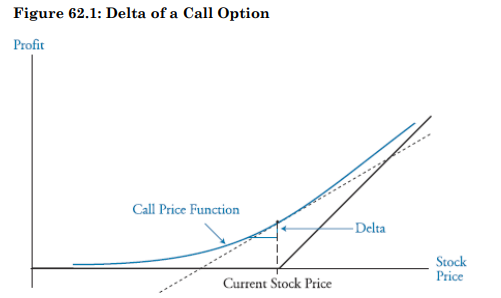
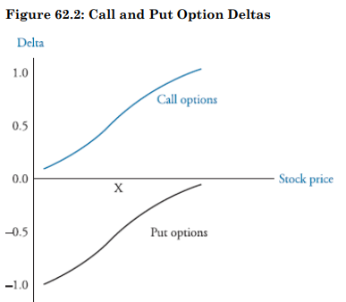

Level of risk associated with an option position is dependent in large part on the following factors:

1. relationship between value of a position involving options and the value of the underlying assets (Delta, Gamma)
2. time until expiration (Theta)
3. asset value volatility (Vega)
4. and risk free rate (Rho)

## Objectives

<input type="checkbox" /> Understand Option Greeks  
<input type="checkbox" /> Effective hedging with Option Greeks  
<input type="checkbox" /> Delta-Neutral Portfolios  
<input type="checkbox" /> Portfolio Insurance

## Naked & Covered Positions

> **Naked Position**  
> When one party sells without owning the underlying asset

> **Covered Position**  
> When the party selling a call option owns the underlying asset

### Stop Loss Strategies

Stop loss strategies with call options are designed to limit the losses associated with writing call options. Objective is to hold a naked position when the option is Out Of The Money and a covered position when the option is In The Money.  
Drawbacks: Transaction costs and price uncertainty

## Delta & Delta Hedging

Delta of an option is the ratio of change in price of an option to the change in price of the underlying asset, s, for small changes in s:

$Delta = \Delta = \frac{\delta c}{\delta s}$
where,  
$\delta c$ = change in call option price  
$\delta s$ = change in stock price

$\delta$ of call options go from 0 to 1  
$\delta$ of put options go from -1 to 0

Call delta of 0.6 means that the price of a call option will change by $0.60 for every $1.00 change in the value of the stock. To hedge a long stock or short call position, an investor must purchase the number of shares of stock equal to the delta times the number of options sold.

Delta can also be calculated as N(d1) in the BSM pricing model.
$d_1 = \frac{ ln({\frac{S_0}{X}}) + (R_f + \frac{\sigma^2}{2})*T }{\sigma*\sqrt{T}}$

> Delta of a Forward position is equal to 1
>
> > A forward position is easy to hedge with an offsetting underlying position with the same number of securities

> When the underlying asset pays a Dividend, q, delta of option or forward must be adjusted. If a q exists:
>
> > Delta of a call option equals $e^{-qT} * N(d1)$  
> > Delta of a put option equals $e^{-qT} * {N(d1) - 1}$  
> > Delta of a forward contract equals $e^{-q*T}$
