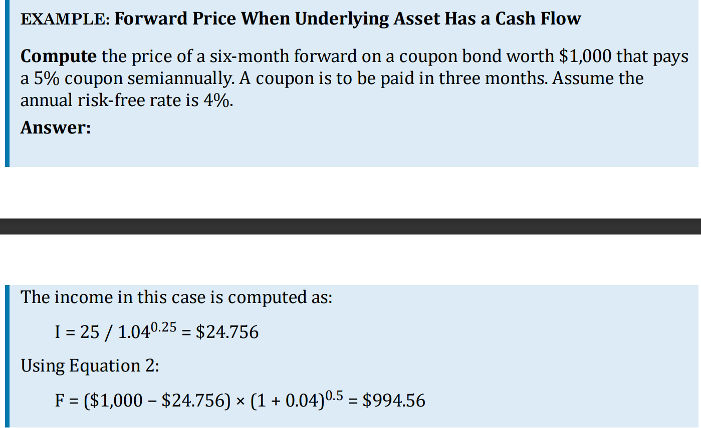
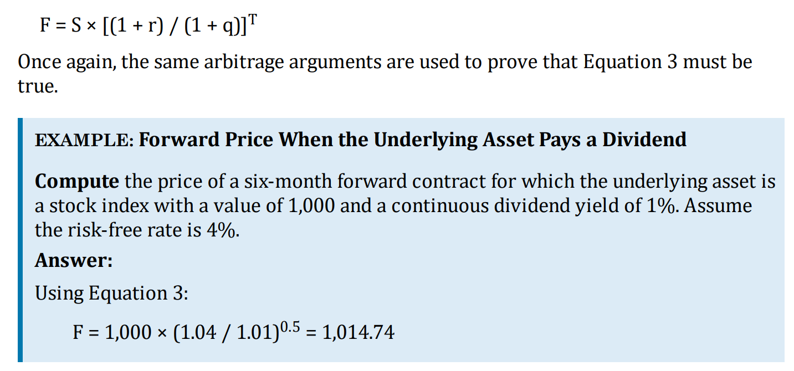

Futures & Forwards are obligations regarding a future transaction. Because of minimal differences between futures and forwards, they are often presented interchangeably.  
Basic model connects forward price to the cost incurred from purchasing and storing the underlying asset until the contract maturity date.  
Cash flows over the life of the contract are easily incorporated into the pricing model.  
Interest rate parity is a key part of pricing financial forwards and futures.

## Forward & Futures Prices

### Financial Assets

3 types:

1. Assets with no income
2. Assets with income that is fixed
3. Assets with income that is a percentage of value

All financial assets are considered **investment assets**.
**Consumption asset** is held for consumption such as commodities like oil and natural gas.

**Short Selling**
involves selling securities that the seller does not own,
and it is possible with some investment assets

## Forward Price with no income or yield

$F = S *(1 + r)^T$
where,
|Variable|Definition|
|---|---|
|$T$|Time to maturity (in year)|
|$S$|Underlying asset price today t = 0|
|$F$|Forward Price Today|
|$r$|Annually compounded risk-free rate|

Right hand side of the equation is the cost of borrowing funds to buy the underlying asset and carrying it forward to time T. That must equal the Forward cost $F$.  
if $F> S*(1+r)^T$, arbitrageurs will profit by selling the Forward and buying the asset with borrowed funds  
if $F<S*(1+r)^T$, arbitrageurs will sell the asset, lend out the proceeds at r and buying the forward.  
Equality must hold.

## Forward price with Income or Yield

Adjustment has to be made for income or yield
Because owner of forward contract does not receive any of the cash flows from the underlying asset between contract origination and delivery. - present value of those cash flows must be deducted from the spot price when calculating the forward price.

$F = (S-I)*(1+r)^T$

## Effect of a known dividend

$F = S*[ \frac{1+r}{1+q} ]^T$

